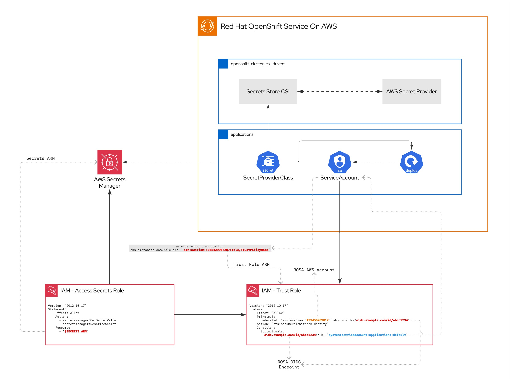

# ROSA STS & AWS Secrets Manager
Integrating ROSA STS with AWS Secrets Manager

#### Workflow

---

### 1. AWS Side
1. Create an AWS Secrets Manager with CloudFormation using the file in **base/aws/**. Pass the OIDC endpoint **without https://** as an argument.

---

### 2. ROSA Side
1. Install **Secret Store CSI Driver** from Operator Hub.
 
2. Install AWS Provider Secret Store and configurations in **base/rosa/** path, you can use the following command: 
`oc apply -f base/rosa/`
 
3. Set ARN from Role, for example, **arn:aws:iam::xxxx:role/AssumeFromOIDC**, into default Service Account in applications namespace as a **eks.amazonaws.com/role-arn** annotation, you can use the following example command: 
`oc annotate sa -n apps eks.amazonaws.com/role-arn='arn:aws:iam::xxxx:role/AssumeFromOIDC'`

